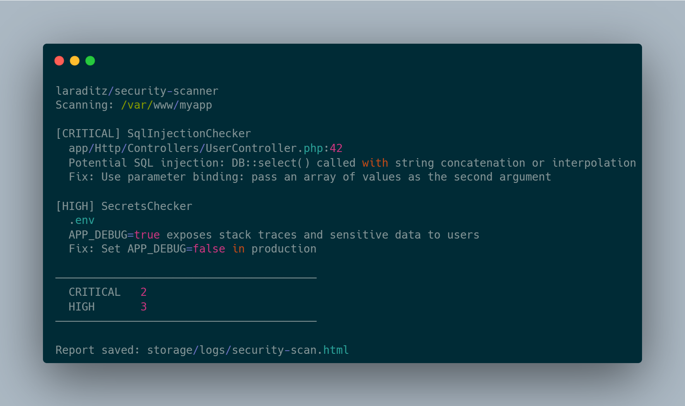

# Laravel Security Scanner

[](https://packagist.org/packages/laraditz/security-scanner)
[](https://packagist.org/packages/laraditz/security-scanner)
[](./LICENSE.md)


A Laravel package that scans your application for common security vulnerabilities via a single Artisan command. It produces a color-coded terminal report and saves detailed JSON and HTML report files.



## Requirements

- PHP 8.2+
- Laravel 10 and above

## Installation

```bash
composer require laraditz/security-scanner
```

Laravel auto-discovers the service provider. No further configuration is needed.

## Usage

### Basic scan

Scans your entire Laravel application rooted at `base_path()`:

```bash
php artisan security:scan
```

### Scan a specific path

```bash
php artisan security:scan --path=/var/www/myapp
```

### Save reports to a custom directory

```bash
php artisan security:scan --output=/tmp/reports
```

### Options

| Option     | Default         | Description                                          |
| ---------- | --------------- | ---------------------------------------------------- |
| `--path`   | `base_path()`   | Path to the Laravel application root to scan         |
| `--output` | `storage/logs/` | Directory where JSON and HTML report files are saved |

## What Gets Scanned

Nine independent checkers run on every scan:

| Checker                 | Severity        | What it detects                                                                                    |
| ----------------------- | --------------- | -------------------------------------------------------------------------------------------------- |
| `SqlInjectionChecker`   | CRITICAL / HIGH | Raw queries with string concatenation or variable interpolation; `DB::unprepared()` usage          |
| `XssChecker`            | HIGH            | Unescaped `{!! $var !!}` Blade output without a sanitizer                                          |
| `MassAssignmentChecker` | HIGH / MEDIUM   | Eloquent models with `$guarded = []` or no `$fillable`/`$guarded` defined                          |
| `SecretsChecker`        | CRITICAL        | Hardcoded credentials, API keys, Stripe keys, AWS access keys; `APP_DEBUG=true` in `.env`          |
| `FileUploadChecker`     | CRITICAL / HIGH | Files stored in `public/`; `getClientOriginalName()` usage; extension-only MIME validation         |
| `MaliciousFileChecker`  | CRITICAL        | PHP files in upload directories; webshell signatures (`eval(base64_decode(`, `system($_GET`, etc.) |
| `AuthorizationChecker`  | HIGH            | Routes under `/admin`, `/dashboard`, `/management` without `auth` middleware                       |
| `CsrfChecker`           | CRITICAL / HIGH | Wildcard CSRF exceptions (e.g. `/api/*`) in `VerifyCsrfToken`                                      |
| `RateLimitChecker`      | HIGH            | Login, register, and password reset routes without `throttle` middleware                           |

See [docs/checkers.md](docs/checkers.md) for detailed descriptions, examples of vulnerable vs. safe code, and remediation advice for each checker.

## Output

### Terminal

Findings are printed to the console grouped by severity (CRITICAL → HIGH → MEDIUM → LOW → INFO), each with:

- Severity label (color-coded)
- Checker name
- File path and line number
- Description of the issue
- Recommended fix

A summary count by severity is printed at the end.

### Report files

Two files are saved after every scan:

| File                            | Description                                                      |
| ------------------------------- | ---------------------------------------------------------------- |
| `security-scan-YYYY-MM-DD.json` | Machine-readable report with all findings and any checker errors |
| `security-scan-YYYY-MM-DD.html` | Dark-themed HTML table report, suitable for sharing with a team  |

Both are saved to `storage/logs/` by default (or the directory specified via `--output`).

## Severity levels

| Level      | Meaning                                      |
| ---------- | -------------------------------------------- |
| `CRITICAL` | Actively exploitable; fix immediately        |
| `HIGH`     | Significant risk; fix before next deployment |
| `MEDIUM`   | Should be addressed; risk depends on context |
| `LOW`      | Best-practice improvement                    |
| `INFO`     | Informational; no immediate action required  |

## Error resilience

If a checker throws an unexpected exception while processing a file, the scanner logs the error and continues — the remaining checkers still run and their findings are still reported. Checker errors are listed in the terminal output and included in the JSON report.

## CI integration

You can run the scanner in CI and fail the pipeline if any findings are returned:

```bash
php artisan security:scan --path=$APP_PATH --output=/tmp
# The command always exits 0 today; pipe through jq for policy enforcement:
jq '.total > 0' /tmp/security-scan-$(date +%F).json && exit 1 || true
```

## Testing

```bash
composer test
```

### Changelog

Please see [CHANGELOG](CHANGELOG.md) for more information what has changed recently.

## Contributing

Please see [CONTRIBUTING](CONTRIBUTING.md) for details.

### Security

If you discover any security related issues, please email raditzfarhan@gmail.com instead of using the issue tracker.

## Credits

- [Raditz Farhan](https://github.com/laraditz)
- [All Contributors](../../contributors)

## License

The MIT License (MIT). Please see [License File](LICENSE.md) for more information.
